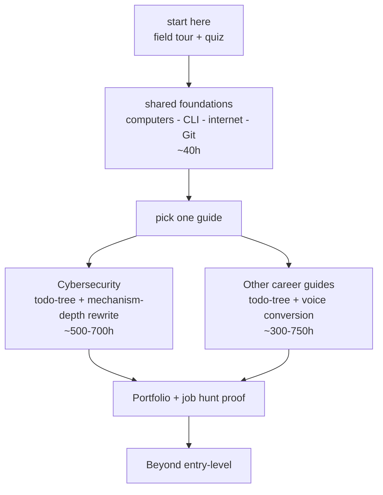

# IT career guides: zero to first job meow

> soft, hour-based learning paths for complete beginners.
> start with shared foundations, then pick a field.
> no job-board lists, no salary tables, no vague "just practice" advice.

[License: CC BY-SA 4.0](LICENSE) | [contributing](CONTRIBUTING.md)

---

## start here first

if youre new to IT, dont pick a field blind.
do this order first:

- [ ] **1. get oriented** - [what each field actually is](start-here/what-is-each-field.md)
- [ ] **2. sanity-check the fit** - [career-match quiz](start-here/career-quiz.md)
- [ ] **3. build the shared floor** - [shared foundations, hours 0-40](start-here/foundations.md)
- [ ] **4. then pick one career guide** - cyber is mechanism-deep; the other guides now use todo-tree + Minnn voice light conversion.

the checkbox is display-only in this public repo.
fork the repo or copy the checklist into your own notes if u want boxes u can actually tick.
the real progress signal is always the gate inside the guide: a measured task passed, a lab done, a project shipped, or an explanation given unaided.

---

## recommended ordering

why this order matters: every technical field assumes u can already use a terminal, explain how the internet moves data, and keep work in Git.
cybersecurity especially sits on top of networking, operating systems, and scripting, so skipping the floor makes the rest feel like noise qwq.

---

## available career paths

| Field | Guide | Study hours | Coding | Cert cost shape |
|---|---|---:|---|---|
| Cybersecurity | [guides/cybersecurity/](guides/cybersecurity/) | 500-700 | some | optional cert ladder; free/freemium labs first |
| Software Development | [guides/software-development/](guides/software-development/) | 400-600 | heavy | mostly free |
| Cloud & DevOps | [guides/cloud-devops/](guides/cloud-devops/) | 500-700 | some | vendor certs optional/paid |
| Data, AI & Analytics | [guides/data-ai-analytics/](guides/data-ai-analytics/) | 500-750 | some | certs optional/paid |
| IT Support & Networking | [guides/it-support-networking/](guides/it-support-networking/) | 400-600 | little | CompTIA/Cisco optional/paid |
| UI/UX Design | [guides/ux-design/](guides/ux-design/) | 350-500 | little | mostly free |
| Product Management | [guides/product-management/](guides/product-management/) | 300-500 | little | mostly free |
| IT Management | [guides/it-management/](guides/it-management/) | 300-500 | little | optional paid certs |

hours are study budgets, not deadlines.
at ~2h/day, 600 hours is about 10 months.
go slower if life needs it; just keep the gates honest.

---

## what each guide gives u

- [ ] todo-tree structure, not vague phases
- [ ] specific hours, so u know the size of the work
- [ ] exact resources and labs where verified, not bare channels as primary instructions
- [ ] measurable gates: scores, completed labs, shipped projects
- [ ] explanation gates where the guide needs proof of understanding
- [ ] cert guidance that treats the exam as a checkpoint, not the reason to study
- [ ] portfolio and interview prep tied to what u built

for cybersecurity, the rewrite goes deeper: each topic teaches mechanism, vocab, exact study sources, a specific lab, and an explanation gate.
for the other guides, this pass is lighter: todo-tree framing, Minnn voice, and obvious source-specificity cleanup.

---

## contributing

found a broken link, stale exam code, or better exact lab?
open an issue or PR using [CONTRIBUTING.md](CONTRIBUTING.md).

keep it specific:

- [ ] deep-link the exact module, playlist, lab, or practice test
- [ ] tag free / freemium / paid honestly
- [ ] avoid salary data and job-board lists
- [ ] keep HTTPS unless the resource is intentionally HTTP-only, like `flaws.cloud`
- [ ] dont add "just practice" without a measurable gate

---

## research basis

the guides use:

- [ ] role-type research without salary tables
- [ ] cert-code and domain verification against official sources where possible
- [ ] lab/platform inventory with current free/freemium options
- [ ] tooling currency checks, because 2021 tech advice gets stale fast

latest rewrite work is July 2026.
prices, cert logistics, and vendor pages can change, so confirm with the provider before booking anything paid.

---

## license

this work is licensed under [Creative Commons Attribution-ShareAlike 4.0 International](LICENSE).
