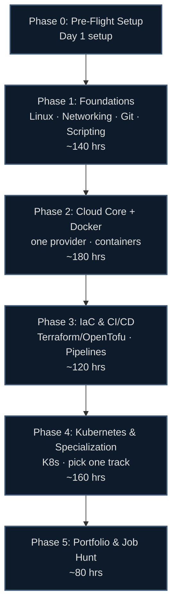

# ☁️ Cloud & DevOps Career Roadmap: Zero to First Job

> [!IMPORTANT]
> **Read this first: "DevOps" is rarely a true entry-level job.** The honest on-ramp is **Cloud Support / Cloud Ops → Junior Cloud Engineer → DevOps Engineer**. This guide gets you hired into that *first* cloud role, then sets you up to grow into DevOps/SRE. Anyone promising you a "Junior DevOps Engineer" title from zero is selling something.

## 🗺️ Roadmap at a Glance



## ⏱️ How the Hour System Works

Timelines are in **study hours**, not weeks — so they work at any pace.

| Your pace | 600 hours takes |
|---|---|
| 1 hr/day | ~20 months |
| 2 hrs/day | ~10 months |
| 4 hrs/day | ~5 months |
| 6 hrs/day (full-time) | ~3.5 months |

Each phase shows an approximate hour band — a budget, not a deadline. Go at whatever pace fits your life.

## 📚 Guide Contents

| File | What's inside |
|---|---|
| [00-prep.md](00-prep.md) | Mindset, the honest career path, accounts, free-tier setup |
| [01-foundations.md](01-foundations.md) | Linux, networking, Git, Bash & Python scripting |
| [02-core.md](02-core.md) | One cloud provider deep (AWS-led): compute, storage, networking, IAM |
| [03-iac-cicd.md](03-iac-cicd.md) | Docker, Terraform & OpenTofu, CI/CD pipelines, GitHub Actions, GitOps |
| [04-kubernetes-specialization.md](04-kubernetes-specialization.md) | Kubernetes (local clusters), observability (Prometheus/Grafana/OTel), specialization tracks |
| [05-job-hunt.md](05-job-hunt.md) | Portfolio projects, resume, finding & targeting roles |
| [beyond-entry.md](beyond-entry.md) | SRE, platform engineering, advanced tracks (Years 2+) |
| [certifications.md](certifications.md) | Full cert matrix, ROI tiers, recommended paths |
| [labs.md](labs.md) | Verified interactive lab inventory |
| [resources.md](resources.md) | Channels, books, communities, roadmaps |
| [interview-prep.md](interview-prep.md) | Technical + behavioral question bank |

## 🏁 Certification Ladder (2026)

```
[Foundation]   AWS Cloud Practitioner (CLF-C02) — or AZ-900 / GCP CDL
[Baseline]     AWS Solutions Architect Associate (SAA-C03) — the real hiring filter
[Differentiator] Terraform Associate (TA-004, $70) + CKA (Kubernetes, hands-on)
[Later]        AWS DevOps Pro / specialty certs — after you're in-role
```

> ⚠️ **Do NOT pursue AZ-204** (retiring July 2026) or **Docker DCA** (discontinued). See [certifications.md](certifications.md).

## ✅ What Makes This Guide Different

- **Honest about the on-ramp** — cloud support/ops first, DevOps later. No hype.
- **Hour-based** — fits any schedule, not rigid weeks.
- **Verified June 2026** — exam codes, prices, and tool versions checked against official sources.
- **Region-agnostic** — no salary tables, no local job-board lists; strategy that travels.
- **Free-first** — AWS Free Tier, KillerCoda, Play with Docker, KodeKloud free tier, k3s/kind local labs.
- **Current stack** — Kubernetes v1.36, Terraform v1.15 **+ OpenTofu**, Helm v4, ArgoCD v3, OpenTelemetry — not 2021 tooling.

---

*Last verified: June 2026. Prices, exam codes, and tool versions change — confirm with the provider before booking. Sources in [/research](../../research/).*
