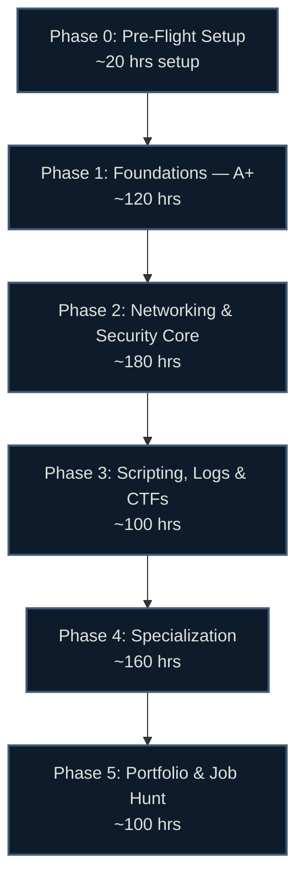

# 🛡️ Cybersecurity Career Roadmap: Zero to First Job

> Hour-based, research-backed (June 2026), region-agnostic. Every hands-on topic points to a **specific, verified, free or freemium lab** — never "open a VM and look around."

[]()
[]()

## 🗺️ Roadmap at a Glance



## ⏱️ How the Hour System Works

Timelines are in **study hours**, not weeks — so they work at any pace.

| Your pace | 600 hours takes |
|---|---|
| 1 hr/day | ~20 months |
| 2 hrs/day | ~10 months |
| 4 hrs/day | ~5 months |
| 6 hrs/day (full-time) | ~3.5 months |

Each phase shows an approximate hour band — a budget, not a deadline. Go at whatever pace fits your life.

## 📚 Guide Contents

| File | What's inside |
|---|---|
| [00-prep.md](00-prep.md) | Mindset, home lab setup, accounts to create |
| [01-foundations.md](01-foundations.md) | Hardware, OS, networking basics (CompTIA A+) |
| [02-core.md](02-core.md) | Network+, ISC2 CC, Security+ — the core trifecta |
| [03-scripting-ctf.md](03-scripting-ctf.md) | Python, PowerShell, KQL/SPL, log analysis, CTFs |
| [04-specialization.md](04-specialization.md) | Blue Team / Red Team / Cloud / GRC paths |
| [05-job-hunt.md](05-job-hunt.md) | Portfolio, resume, applications, role targeting |
| [beyond-entry.md](beyond-entry.md) | Mid-to-senior tracks (Years 2+) |
| [certifications.md](certifications.md) | Full cert matrix, ROI tiers, recommended paths |
| [labs.md](labs.md) | Verified interactive lab inventory |
| [resources.md](resources.md) | Books, channels, communities, job boards |
| [interview-prep.md](interview-prep.md) | Technical + behavioral question bank |

## 🏁 Certification Ladder (2026)

```
[Free Start]   ISC2 CC (free, DoD-approved)
[Baseline]     CompTIA A+ (220-1201/1202) → Network+ (N10-009) → Security+ (SY0-701)
[Blue Team]    BTL1 → SC-200 or CySA+
[Red Team]     eJPT → PNPT or HTB CPTS → (OSCP, year 2)
[Cloud]        SC-900 → AWS Security / Azure security successor
[GRC]          Security+ + framework fluency → (CISA/CISM, after experience)
```

> ⚠️ **Do NOT pursue AZ-500** — it retires **Aug 31, 2026**. See [certifications.md](certifications.md) for the successor situation.

See **[certifications.md](certifications.md)** for verified codes, prices, domain weights, and which certs to skip.

## ✅ What Makes This Guide Different

- **Hour-based** — fits any schedule, not rigid weeks.
- **Verified June 2026** — exam codes, prices, and lab links checked against official sources.
- **Region-agnostic** — no salary or local job-board data; teaches role-targeting that works anywhere. See [05-job-hunt.md](05-job-hunt.md).
- **Free-first** — 50%+ of every topic's resources are free; paid items always have a free alternative.
- **Current stack** — teaches Sentinel/Splunk/Wazuh, MITRE ATT&CK v19.1, NIST CSF 2.0, OWASP 2025, Sigma — not 2021 tooling.

---

*Last verified: June 2026. Prices and exam codes change — confirm with the provider before booking. Sources in [/research](../../research/).*
