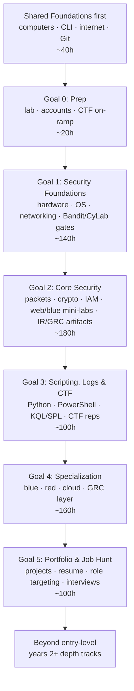

# cybersecurity career guide: zero to first job meow

> hour-based, todo-driven, mechanism-deep path for learning security without getting lost.
> security sits on top of networking + operating systems + scripting, so the guide keeps those floors visible the whole way qwq.

[Back to main README](../../README.md) | [Labs index](labs.md) | [Resources](resources.md) | [Certifications](certifications.md)

---

## why this field is still worth choosing meow

quick comfort before the hard stuff:
if ur worried AI makes every tech path feel shaky, cyber is one of the calmer bets rn.

AI helps here. a lot.
it can summarize logs, draft queries, review code, enrich alerts, and speed up boring first passes.

but security is adversarial meow.
someone is trying to abuse a real system, inside a real org, with messy logs, legal scope, business risk, weird configs, and humans making mistakes.
AI can help with pieces of that.
it still cannot own the judgment: what happened, what matters, what to fix first, what risk to explain.

thats why this guide makes u learn theory **and** touch labs/CTFs/projects.
u get the names and mechanisms from study sources, then u get practical experience from doing the thing.
and quietly, without making the exam the whole personality, that same knowledge makes exam questions less scary later.

so dw.
the tools will change.
the need to understand systems, evidence, attackers, and risk is not going away that easily.

---

## the path at a glance



**assumed pace:** ~2h/day.
the whole path is roughly **500-700 study hours**, usually around 8-12 months at a steady part-time pace.
hours are a budget, not a deadline.

---

## how to track your progress meow

the `- [ ]` boxes in these files are display-only in this public repo.
u cant tick them here unless u commit to the public project, which is not your personal tracker ;w;

use one of these instead:

- **fork this repo** and tick boxes in your fork.
- **copy the checklist into Obsidian / OneNote** and track it there.
- **print/download the page** if paper works better.

the checkbox is not the proof.
the proof is always:

1. **measurable gate** - score, lab passed, report written, alert closed, box rooted, or artifact shipped.
2. **can u explain it?** - out loud or written, unaided, saying why the mechanism works.

both must pass before a topic is really done.
dw if that sounds strict - it is there so u never wonder "am i ready or just tired of this page?" meow.

---

## todo-tree

- [ ] **Start before cyber** - [Shared Foundations](../../start-here/foundations.md) (~40h): computers, CLI, internet, Git.
- [ ] **Goal 0 - Prep** - [00-prep.md](00-prep.md) (~20h): lab setup, accounts, community, CTF day-one framing.
- [ ] **Goal 1 - Foundations** - [01-foundations.md](01-foundations.md) (~140h): hardware, OS, networking, Bandit, CyLab, and first explain gates.
- [ ] **Goal 2 - Core Security** - [02-core.md](02-core.md) (~180h): networking labs, crypto/PKI, IAM, PortSwigger/Natas, VM hardening, IR/GRC artifacts.
- [ ] **Goal 3 - Scripting, Logs & CTF** - [03-scripting-ctf.md](03-scripting-ctf.md) (~100h): Python, PowerShell, KQL/SPL, CTF reps.
- [ ] **Goal 4 - Specialization** - [04-specialization.md](04-specialization.md) (~160h): choose blue, red, cloud, or GRC-first; add the GRC layer.
- [ ] **Goal 5 - Portfolio & Job Hunt** - [05-job-hunt.md](05-job-hunt.md) (~100h): projects, resume, role targeting, interview stories.
- [ ] **After first role** - [beyond-entry.md](beyond-entry.md): years 2+ depth paths.

---

## guide files

| File | what its for |
|---|---|
| [00-prep.md](00-prep.md) | build the lab, create accounts, start CTF safely from day one |
| [01-foundations.md](01-foundations.md) | hardware, OS, networking, Bandit/CyLab gates, first explain checks |
| [02-core.md](02-core.md) | core security mechanisms proved through labs, CTFs, packet work, and artifacts |
| [03-scripting-ctf.md](03-scripting-ctf.md) | scripting, sockets, KQL/SPL, log parsing, CTF progression |
| [04-specialization.md](04-specialization.md) | blue/SOC, red/pentest, cloud security, GRC layer |
| [05-job-hunt.md](05-job-hunt.md) | portfolio projects, resume targeting, NICE role mapping, interviews |
| [labs.md](labs.md) | verified lab index and stale-link replacement shelf |
| [resources.md](resources.md) | exact learning resources, tools, frameworks, communities |
| [interview-prep.md](interview-prep.md) | Q-bank plus mechanism-style answer practice |
| [certifications.md](certifications.md) | cert matrix, logistics, ROI tiers, study-order map |
| [beyond-entry.md](beyond-entry.md) | years 2+ tracks after the first role |

---

## lab-first spine

certs are not the path.
they are optional labels on top of proof u already built.

the actual path looks like this:

```text
prep lab -> Bandit/CyLab -> networking + Wireshark -> CryptoHack -> Natas/PortSwigger
-> VM hardening + SOC/packet cases -> IR runbook + risk note -> specialization labs
```

that is the order bc security skill is mostly "can i do it, name what happened, and explain why it worked."
a practice test can catch vocab gaps, but it cannot replace the lab proof meow.

the theory is still there.
the study sources give u the names, theory, and exam-shaped language.
the labs, CTF reps, and projects turn that theory into experience so it actually sticks.
that way exam readiness builds quietly in the background while u are just learning the work.

---

## where cert details live

study the **topic**, not the cert silo.
the exam is downstream of understanding and lab proof.

all exam-domain maps, current codes, price notes, stale-cert warnings, practice-test sources, and booking gates live in [certifications.md](certifications.md).
the goal files stay focused on the full learning loop: theory, study sources, labs, CTF reps, artifacts, and explain gates.

---

## what makes this guide different

- **hours, not weeks** - works at 1h/day or 4h/day.
- **specific labs** - OverTheWire Bandit, PortSwigger labs, CyberDefenders DanaBot, LetsDefend, KC7, flaws.cloud, CloudGoat, and more.
- **two gates** - a measurable gate proves u can do it; `can u explain it?` proves u understand why.
- **CTF from day one** - Bandit/CyLab/PortSwigger grow beside the topics instead of being buried at the end.
- **certs kept in one hub** - when u need exam domains or logistics, [certifications.md](certifications.md) translates the work after the labs.
- **free-first** - paid certs and courses are optional checkpoints, not the required path.

---

*Last checked against rewrite research notes: July 2026. prices and vendor pages change, so confirm before buying anything paid.*
