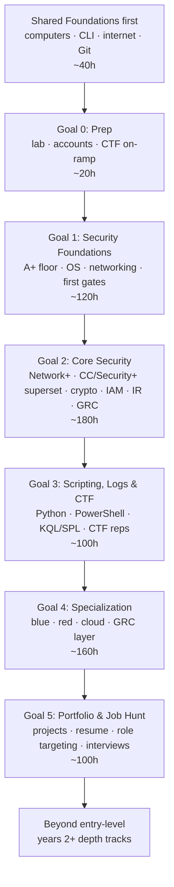

# Cybersecurity career guide: zero to first job meow

> hour-based, todo-driven, mechanism-deep path for learning security without getting lost.
> security sits on top of networking + operating systems + scripting, so the guide keeps those floors visible the whole way qwq.

[Back to main README](../../README.md) | [Labs index](labs.md) | [Resources](resources.md) | [Certifications](certifications.md)

---

## the path at a glance



**assumed pace:** ~2h/day.
the whole path is roughly **500-700 study hours**, usually around 8-12 months at a steady part-time pace.
hours are a budget, not a deadline.

---

## how to track your progress meow

the `- [ ]` boxes in these files are display-only in this public repo.
u cant tick them here unless u commit to the public project, which is not your personal tracker ;w;

use one of these instead:

- **fork this repo** and tick boxes in your fork.
- **copy the checklist into Obsidian / OneNote** and track it there.
- **print/download the page** if paper works better.

the checkbox is not the proof.
the proof is always:

1. **measurable gate** - score, lab passed, report written, alert closed, box rooted, or artifact shipped.
2. **can u explain it?** - out loud or written, unaided, saying why the mechanism works.

both must pass before a topic is really done.
dw if that sounds strict - it is there so u never wonder "am i ready or just tired of this page?" meow.

---

## todo-tree

- [ ] **Start before cyber** - [Shared Foundations](../../start-here/foundations.md) (~40h): computers, CLI, internet, Git.
- [ ] **Goal 0 - Prep** - [00-prep.md](00-prep.md) (~20h): lab setup, accounts, community, CTF day-one framing.
- [ ] **Goal 1 - Foundations** - [01-foundations.md](01-foundations.md) (~120h): A+ floor, OS, networking, first security concepts.
- [ ] **Goal 2 - Core Security** - [02-core.md](02-core.md) (~180h): Network+, ISC2 CC/Security+ superset, crypto, IAM, IR, GRC.
- [ ] **Goal 3 - Scripting, Logs & CTF** - [03-scripting-ctf.md](03-scripting-ctf.md) (~100h): Python, PowerShell, KQL/SPL, CTF reps.
- [ ] **Goal 4 - Specialization** - [04-specialization.md](04-specialization.md) (~160h): choose blue, red, cloud, or GRC-first; add the GRC layer.
- [ ] **Goal 5 - Portfolio & Job Hunt** - [05-job-hunt.md](05-job-hunt.md) (~100h): projects, resume, role targeting, interview stories.
- [ ] **After first role** - [beyond-entry.md](beyond-entry.md): years 2+ depth paths.

---

## guide files

| File | what its for |
|---|---|
| [00-prep.md](00-prep.md) | build the lab, create accounts, start CTF safely from day one |
| [01-foundations.md](01-foundations.md) | OS, hardware, networking, A+ floor, first measurable gates |
| [02-core.md](02-core.md) | merged security-fundamentals study group: Network+, ISC2 CC, Security+ |
| [03-scripting-ctf.md](03-scripting-ctf.md) | scripting, sockets, KQL/SPL, log parsing, CTF progression |
| [04-specialization.md](04-specialization.md) | blue/SOC, red/pentest, cloud security, GRC layer |
| [05-job-hunt.md](05-job-hunt.md) | portfolio projects, resume targeting, NICE role mapping, interviews |
| [labs.md](labs.md) | verified lab index and stale-link replacement shelf |
| [resources.md](resources.md) | exact learning resources, tools, frameworks, communities |
| [interview-prep.md](interview-prep.md) | Q-bank plus mechanism-style answer practice |
| [certifications.md](certifications.md) | cert matrix, logistics, ROI tiers, study-order map |
| [beyond-entry.md](beyond-entry.md) | years 2+ tracks after the first role |

---

## cert checkpoint framing

study the **topic**, not the cert silo.
the exam is downstream of understanding.

```text
Foundations:   A+ 220-1201/1202 (optional if u need the IT floor signal)
Networking:    Network+ N10-009, then deeper networking if needed
Sec core:      ISC2 CC study gates + Security+ SY0-701 as the HR baseline
Blue/SOC:      BTL1 (Centri) / SC-200 / CySA+ CS0-004
Red/Pentest:   eJPT v2 / HTB CPTS / PNPT, then OSCP later
Cloud:         SC-900 -> SC-500, or AWS Security Specialty SCS-C03
GRC:           Security+ Domain 5 + framework fluency; CISA/CISM later after experience
```

important currency notes:

- **ISC2 CC is no longer free**; the free voucher program closed in 2026. use the guide gates as the free checkpoint, paid exam optional.
- **AZ-500 retires August 31, 2026**; new Azure-security learners should look at **SC-500** instead.
- **AWS SCS-C03 is current**; old SCS-C02 PDFs are stale.
- **INE PTS is not free anymore**; use the free red-team prep stack first, then pay for eJPT only if that checkpoint helps.

see [certifications.md](certifications.md) for the data sheet and study-order map. that file is the cert hub.

---

## what makes this guide different

- **hours, not weeks** - works at 1h/day or 4h/day.
- **specific labs** - OverTheWire Bandit, PortSwigger labs, CyberDefenders DanaBot, LetsDefend, KC7, flaws.cloud, CloudGoat, and more.
- **two gates** - a measurable gate proves u can do it; `can u explain it?` proves u understand why.
- **CTF from day one** - Bandit/CyLab/PortSwigger grow beside the topics instead of being buried at the end.
- **cert domains mapped to topics** - u always know which study block serves which exam domain.
- **free-first** - paid certs and courses are optional checkpoints, not the required path.

---

*Last checked against rewrite research notes: July 2026. prices and vendor pages change, so confirm before buying anything paid.*
