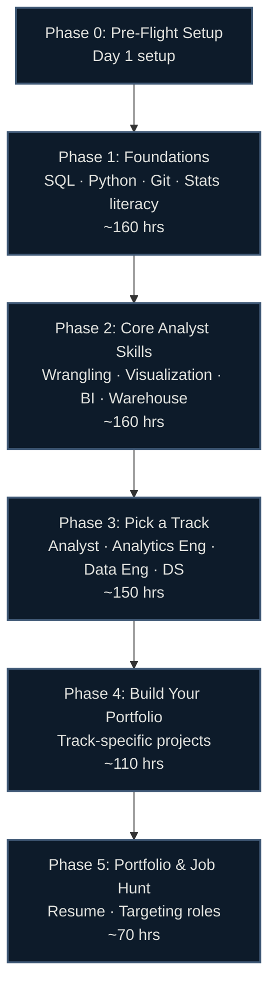

# 📊 Data, AI & Analytics Career Roadmap: Zero to First Job

> Hour-based, research-backed (June 2026), region-agnostic. Every topic points to a **specific, verified, free or freemium lab** — never "go figure it out." Built for complete beginners with no degree.

[]()
[]()

> [!IMPORTANT]
> **Read this first: "Data Scientist" and "ML Engineer" are NOT entry-level jobs.** The honest entry door is **Data Analyst → Analytics Engineer → Data Engineer / Data Scientist**. Most postings titled "Junior Data Scientist" actually want a strong analyst with some ML familiarity, and real ML roles almost always require a master's or prior experience. This guide gets you hired into that *first* data role (Analyst or Analytics Engineer), then sets you up to grow. Anyone promising a "Data Scientist" title from zero is selling something.

## 🗺️ Roadmap at a Glance



## ⏱️ How the Hour System Works

Timelines are in **study hours**, not weeks — so they work at any pace.

| Your pace | 680 hours takes |
|---|---|
| 1 hr/day | ~22 months |
| 2 hrs/day | ~11 months |
| 4 hrs/day | ~6 months |
| 6 hrs/day (full-time) | ~4 months |

Each phase shows an approximate hour band — a budget, not a deadline. Go at whatever pace fits your life.

## 📚 Guide Contents

| File | What's inside |
|---|---|
| [00-prep.md](00-prep.md) | Mindset, the honest career path, accounts, free tooling setup |
| [01-foundations.md](01-foundations.md) | SQL, Python, Git, statistics literacy, spreadsheets |
| [02-core.md](02-core.md) | Data wrangling (pandas/DuckDB), visualization, one BI tool, one cloud warehouse |
| [03-specialization.md](03-specialization.md) | Pick a track: Data/BI Analyst, Analytics Engineer (dbt), Data Engineer, or Data Science |
| [04-projects.md](04-projects.md) | Portfolio projects per track, with architecture & write-ups |
| [05-job-hunt.md](05-job-hunt.md) | Resume, profiles, finding & targeting roles, interview routing |
| [beyond-entry.md](beyond-entry.md) | Senior tracks, ML engineering, data architecture (Years 2+) |
| [certifications.md](certifications.md) | Full cert matrix, ROI tiers, recommended paths |
| [labs.md](labs.md) | Verified interactive lab inventory |
| [resources.md](resources.md) | Channels, books, communities, datasets |
| [interview-prep.md](interview-prep.md) | Technical + behavioral question bank |

## 🏁 Certification Ladder (2026)

```
[Foundation]   Google Data Analytics Professional Certificate (SQL/viz base)
[Baseline]     PL-300 Power BI — real ATS filter for BI/analyst roles
[Differentiator] dbt Analytics Engineering Cert ($200) + one cloud (SnowPro Core / BigQuery)
[Later]        AWS DEA-C01 / MLA-C01 / Databricks — after you target DE or ML
```

> ⚠️ **Do NOT pursue DP-203 or DP-100 (RETIRED 2025) or AWS MLS-C01 (retired March 2026).** See [certifications.md](certifications.md).

## ✅ What Makes This Guide Different

- **Honest about the entry door** — Analyst/Analytics Engineer first, "Data Scientist" later. No false promises.
- **SQL-first** — the one skill every track needs and every interview screens for.
- **Hour-based** — fits any schedule, not rigid weeks.
- **Verified June 2026** — cert codes, retirements, and tool versions checked against official sources.
- **Region-agnostic** — no salary tables, no local job-board lists; strategy that works anywhere.
- **Free-first** — SQLBolt, Kaggle Learn, DuckDB, BigQuery sandbox, Google Colab, dbt free tier.
- **Current stack** — Python 3.13, pandas 3.0, DuckDB, Polars, dbt 1.11, PyTorch 2.12, plus an honest take on GenAI/LLMs for juniors — not 2021 tooling.

---

*Last verified: June 2026. Cert codes, prices, and tool versions change — confirm with the provider before booking. Sources in [/research](../../research/).*
