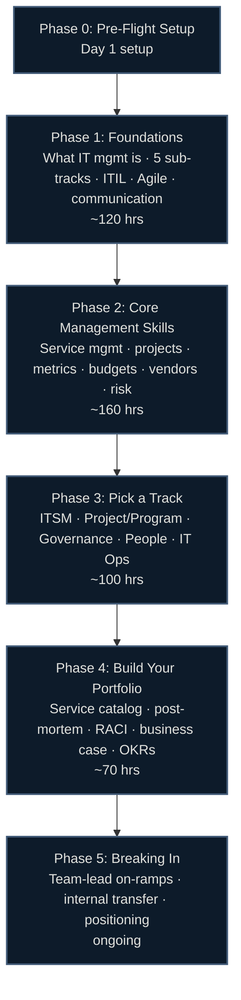

# 🗺️ IT Management & Strategy Career Roadmap: Zero to First Job

> Hour-based, research-backed (June 2026), region-agnostic. Every topic points to a **specific, verified, free or freemium resource** — never "go figure it out." Made for technical people moving into leadership and career-switchers aiming at their first IT management role.

[]()
[]()

> [!IMPORTANT]
> **Read this first: "IT Manager" is a destination, not an entry point.** Almost no one is hired straight into IT management with zero experience. You manage budgets, people, vendors, and risk — authority that organizations only hand to people who have earned credibility by doing the work first. A weak IT manager slows an entire function, so companies hire defensively.
>
> **The realistic on-ramps are:** (1) the **Service/Operations track** — help desk → senior support → team lead → IT manager (most common), (2) the **Project track** — coordinator → project manager → program/PMO lead, (3) the **Technical/Architecture track** — sysadmin/engineer → tech lead → architect → governance/strategy, and (4) the **Business/MBA track** — analyst or consulting into IT governance and strategy.
>
> This guide builds the skills, frameworks, and artifacts those on-ramps require. Treat it as a multi-year career arc you can start preparing for now — not a 3-month sprint into a manager title.

---

## 🗺️ Roadmap at a Glance



---

## ⏱️ How the Hour System Works

Timelines are in **study hours**, not weeks — so they work at any pace.

| Your pace | 500 hours takes |
|---|---|
| 1 hr/day | ~17 months |
| 2 hrs/day | ~8 months |
| 4 hrs/day | ~4 months |
| 6 hrs/day (full-time) | ~3 months |

Each phase shows an approximate hour band — a budget, not a deadline. Go at whatever pace fits your life.

> **Note:** these hours build the *knowledge and artifacts*. The experience that actually unlocks a manager title is earned on the job, over years. This guide gets you ready to step up the moment the opening appears.

---

## 📚 Guide Contents

| File | What's inside |
|---|---|
| [00-prep.md](00-prep.md) | The honest career reality (destination role), the four on-ramps, the IC→manager mindset shift, free tool setup, how to use this guide |
| [01-foundations.md](01-foundations.md) | What IT management is, the five sub-tracks and how they diverge, ITIL 4 service-management basics, Agile/Scrum vocabulary, communication as the core skill |
| [02-core.md](02-core.md) | Service management (incident/change/problem), project delivery, metrics & SLAs, IT budgeting (CapEx/OpEx, TCO/ROI), vendor management, risk registers, stakeholder management |
| [03-specialization.md](03-specialization.md) | Five tracks to go deep: ITSM, Project/Program, Governance & Strategy (COBIT/TOGAF), People/Engineering Management, IT Operations |
| [04-projects.md](04-projects.md) | The management "portfolio" (thinking artifacts): service catalog, post-mortem, RACI, 90-day plan, OKRs, risk register, business case |
| [05-job-hunt.md](05-job-hunt.md) | The realistic on-ramps, positioning a transition, targeting employer types, interview overview |
| [beyond-entry.md](beyond-entry.md) | Team Lead → IT Manager → Senior Manager → Director → CIO/VP ladder (Years 2+), IC-vs-management fork |
| [certifications.md](certifications.md) | Full cert matrix, tier ranking, employer signal, recommended paths per track |
| [labs.md](labs.md) | Verified tool and practice inventory |
| [resources.md](resources.md) | Books, courses, frameworks, communities |
| [interview-prep.md](interview-prep.md) | Interview formats, question bank, STAR prompts, the "why management?" angle |

---

## 🏁 Certification Reality (2026)

```
[Entry signal]    ITIL 4 Foundation — the most recognized ITSM baseline; no prerequisites
[Project track]   CAPM / CompTIA Project+ — entry PM signal; PMP later (needs 3 yr exp)
[Agile shops]     PSM I / PSPO I — credible Scrum vocabulary, lifetime-valid
[Governance]      COBIT Foundation — intro to IT governance; CGEIT is the senior destination
[Architecture]    TOGAF — enterprise architecture / strategy track
[Skip early]      CGEIT / CISM / PMP — require years of experience; not entry credentials
```

> ⚠️ **Certs prove vocabulary, not capability to manage.** Hiring managers for IT leadership weight demonstrated judgment, communication, and a track record over any certificate. ITIL 4 Foundation is the one cheap, near-universal baseline worth getting early (see [certifications.md](certifications.md)). The rest are strategic, track-specific, and several require experience you won't have yet.

---

## ✅ What Makes This Guide Different

- **Honest about the entry door** — no pretending you'll become an IT manager in 3 months. Names the four real on-ramps.
- **Maps the five sub-tracks** — ITSM, Project/Program, Governance/Strategy, People Management, and IT Operations are *different jobs*. This guide shows where they diverge so you can aim.
- **Clear boundary vs. neighbors** — IT management is not Product Management (you run an IT *function*, not a *product*) and not IT Support (you lead the function, you don't do the hands-on troubleshooting).
- **Portfolio = thinking artifacts** — service catalogs, post-mortems, RACI matrices, business cases. What hiring managers read to judge whether you can manage.
- **Framework-grounded** — ITIL 4, COBIT 2019, TOGAF, PMBOK, and SFIA 9 as a self-assessment maturity tool.
- **Hour-based** — fits any schedule.
- **Verified June 2026** — cert codes, exam formats, and tool tiers checked against official sources; prices hedged where vendor pages block automated checks.
- **Region-agnostic** — no salary tables, no local job-board lists; strategy that works anywhere.
- **Free-first** — Notion, Jira free tier, Confluence free, ServiceNow Developer Instance, PagerDuty docs, all free.

---

*Last verified: June 2026. Cert prices, tool tiers, and framework versions change — confirm with the provider before committing. Sources in [/research](../../research/).*
