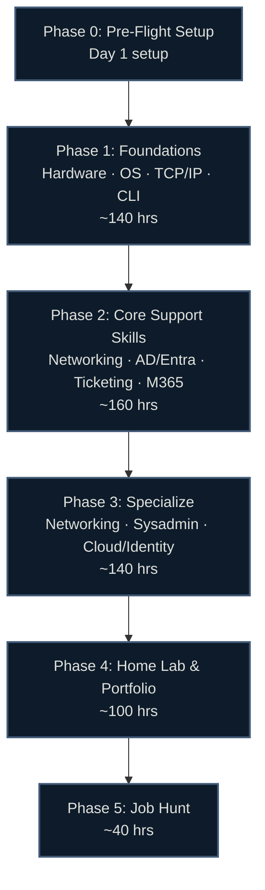

# 🖥️ IT Support & Networking Career Roadmap: Zero to First Job

> Hour-based, research-backed (June 2026), region-agnostic. Every topic points to a **specific, verified, free or freemium lab** — never "go figure it out." Written for complete beginners with no degree.

[]()
[]()

> [!IMPORTANT]
> **This is the most accessible true entry point in all of IT.** Unlike DevOps, Data Science, or Security, IT Support hires from genuine zero — no degree, no prior tech job needed. The honest ladder is **Help Desk (T1) → Desktop Support / NOC → Junior Sysadmin / Network Tech → Network Admin / Cloud / Security pivot.** This guide gets you hired into that *first* help-desk or support role, then sets you up to climb or pivot into networking, cloud, or security.

## 🗺️ Roadmap at a Glance



## ⏱️ How the Hour System Works

Timelines are in **study hours**, not weeks — so they work at any pace.

| Your pace | 600 hours takes |
|---|---|
| 1 hr/day | ~20 months |
| 2 hrs/day | ~10 months |
| 4 hrs/day | ~5 months |
| 6 hrs/day (full-time) | ~3.5 months |

Each phase shows an approximate hour band — a budget, not a deadline. Go at whatever pace fits your life.

## 📚 Guide Contents

| File | What's inside |
|---|---|
| [00-prep.md](00-prep.md) | Mindset, the honest career ladder, accounts, free tooling setup |
| [01-foundations.md](01-foundations.md) | Hardware, OS troubleshooting, TCP/IP, DNS/DHCP, CLI |
| [02-core.md](02-core.md) | Networking depth, Active Directory + Entra ID, ticketing, M365 admin |
| [03-specialization.md](03-specialization.md) | Pick a track: Networking (CCNA), Sysadmin, or Cloud/Identity |
| [04-homelab-portfolio.md](04-homelab-portfolio.md) | Home lab builds, documentation, portfolio that proves skills |
| [05-job-hunt.md](05-job-hunt.md) | Resume, profiles, finding & targeting roles, interview routing |
| [beyond-entry.md](beyond-entry.md) | Network/cloud/security tracks, automation (Years 2+) |
| [certifications.md](certifications.md) | Full cert matrix, ROI tiers, recommended paths |
| [labs.md](labs.md) | Verified interactive lab inventory |
| [resources.md](resources.md) | Channels, books, communities, practice tools |
| [interview-prep.md](interview-prep.md) | Technical + behavioral question bank |

## 🏁 Certification Ladder (2026)

```
[Foundation]   CompTIA A+ (Core 1 V15 + Core 2) — the genuine help-desk filter
[Baseline]     CompTIA Network+ (N10-009 / V9) — networking fundamentals
[Differentiator] AZ-900 + MD-102 (endpoint/Intune) OR CCNA (networking depth)
[Later]        Security+ / CCNA / AWS — pick by your pivot target
```

> ⚠️ **MS-900 alone is thin and the modern-desktop path changed** — endpoint admin is now **MD-102**. See [certifications.md](certifications.md).

## ✅ What Makes This Guide Different

- **The honest accessible door** — A+ → help desk really does hire from zero. No false barriers, no false promises.
- **Hybrid identity reality** — Active Directory **and** Entra ID together, not on-prem-only like 2018 guides.
- **Hour-based** — fits any schedule, not rigid weeks.
- **Verified June 2026** — cert codes (A+ V15, Network+ V9), retirements, and tool versions checked against official sources.
- **Region-agnostic** — no salary tables, no local job-board lists; strategy that works anywhere.
- **Free-first** — Professor Messer (free A+/Net+ training), Packet Tracer, free M365 dev tenant, VirtualBox home labs.
- **Current stack** — PowerShell 7.6, Windows 11 / Server 2025, Intune/Autopilot (not legacy SCCM/imaging), Wireshark 4.6.

---

*Last verified: June 2026. Cert codes, prices, and tool versions change — confirm with the provider before booking. Sources in [/research](../../research/).*
