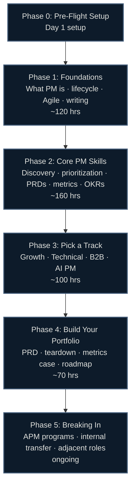

# 🗺️ Product Management Career Roadmap: Zero to First Job

> Hour-based, research-backed (June 2026), region-agnostic. Every topic links to a **specific, verified, free or freemium resource** — never "go figure it out." Built for career-switchers and new grads working toward their first PM role.

[]()
[]()

> [!IMPORTANT]
> **Read this first: Product Management is NOT a true entry-level field.** Even postings labeled "Junior PM" routinely ask for 2–5 years of relevant experience. PMs need earned credibility with engineers, designers, and executives — judgment that comes from having shipped things, not from studying frameworks. A bad PM slows an entire team, so companies hire defensively.
>
> **The realistic on-ramps are:** (1) APM / RPM programs (competitive, but the clearest structured zero-experience door), (2) internal transfer from engineering, design, data, or sales, (3) a PM-adjacent role first (Product Analyst, Business Analyst, TPM, Product Ops), (4) a startup where you can own a surface area faster, or (5) an MBA at a company with a PM pipeline.
>
> This guide builds the skills and artifacts those on-ramps require. Treat it as a 6–18 month project, not a 3-month sprint.

---

## 🗺️ Roadmap at a Glance



---

## ⏱️ How the Hour System Works

Timelines are in **study hours**, not weeks — so they work at any pace.

| Your pace | 500 hours takes |
|---|---|
| 1 hr/day | ~17 months |
| 2 hrs/day | ~8 months |
| 4 hrs/day | ~4 months |
| 6 hrs/day (full-time) | ~3 months |

Each phase shows an approximate hour band — a budget, not a deadline. Go at whatever pace fits your life.

---

## 📚 Guide Contents

| File | What's inside |
|---|---|
| [00-prep.md](00-prep.md) | The honest career reality, mindset, free tool setup, how to use this guide |
| [01-foundations.md](01-foundations.md) | What PM is (vs Product Owner), the product lifecycle, Agile/Scrum, communication as a core skill |
| [02-core.md](02-core.md) | Discovery vs delivery, prioritization frameworks, PRDs, user stories, metrics, OKRs, JTBD, stakeholder management |
| [03-specialization.md](03-specialization.md) | Four tracks: Growth PM, Technical PM, B2B/Enterprise PM, AI PM |
| [04-projects.md](04-projects.md) | The PM "portfolio" (thinking artifacts): PRD, teardown, metrics case, estimation, competitive analysis, roadmap |
| [05-job-hunt.md](05-job-hunt.md) | APM programs, internal transfer, PM-adjacent on-ramps, targeting, interview prep overview |
| [beyond-entry.md](beyond-entry.md) | PM → Senior PM → Group PM → Director → VP/CPO career ladder (Years 2+) |
| [certifications.md](certifications.md) | Full cert matrix, employer signal ranking, recommended paths |
| [labs.md](labs.md) | Verified tool and practice inventory |
| [resources.md](resources.md) | Books, courses, channels, communities |
| [interview-prep.md](interview-prep.md) | Interview formats, question bank, STAR prompts, AI PM angle |

---

## 🏁 Certification Reality (2026)

```
[Entry signal]    PSPO I / CAPM — cheap, shows you did the work
[Scrum shops]     CSPO (2-day course, attendance) / PSM I
[Enterprise/gov]  PMP — the only cert with real gatekeeping power; needs 3 yr exp
[B2B/SaaS]        Pragmatic Institute PMC — recognized in shops using Pragmatic Framework
[Skip]            Product School cert · AIPMM CPM — low employer recognition in tech
```

> ⚠️ **In tech and startups, certs are mostly ignored.** Product sense and shipped artifacts win. Pursue certs strategically (see [certifications.md](certifications.md)), not as a substitute for a portfolio.

---

## ✅ What Makes This Guide Different

- **Brutally honest about the entry door** — no pretending you'll "zero-to-PM" in 3 months. Names the real on-ramps.
- **Busts the "CEO of the product" myth** — PMs have influence without authority. That's the actual job.
- **Distinguishes PM from Product Owner** — following the Marty Cagan/SVPG framework, a lot of "PM" job postings are really tactical ticket-writing PO work. This guide teaches the discovery and strategy layer.
- **Portfolio = thinking artifacts** — not a visual design portfolio. PRDs, teardowns, and prioritization docs are what PM hiring actually looks at.
- **Hour-based** — fits any schedule.
- **Verified June 2026** — tool pricing, cert costs, and APM program status checked against sources.
- **Region-agnostic** — no salary tables, no local job-board lists; strategy that works anywhere.
- **Free-first** — Notion, Jira free tier, Amplitude free tier, Google Analytics 4, DataLemur, all free.

---

*Last verified: June 2026. Cert prices, tool tiers, and APM program availability change — confirm with the provider before committing. Sources in [/research](../../research/).*
