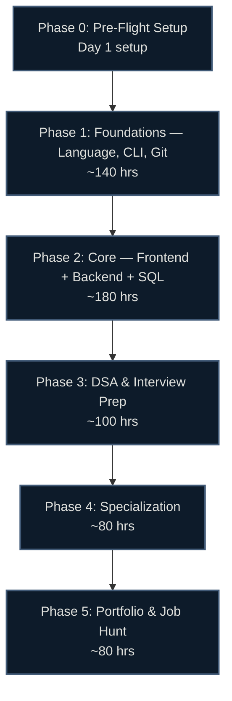

# 💻 Software Development Career Roadmap: Zero to First Job

> Hour-based, research-backed (June 2026), region-agnostic. Every topic points to a **specific, verified, free or freemium lab** — never "go figure it out." Built for complete beginners with no degree.

## 🗺️ Roadmap at a Glance

## ⏱️ How the Hour System Works

Timelines are in **study hours**, not weeks — so they work at any pace.

| Your pace | 500 hours takes |
|---|---|
| 1 hr/day | ~16 months |
| 2 hrs/day | ~8 months |
| 4 hrs/day | ~4 months |
| 6 hrs/day (full-time) | ~3 months |

Each phase shows an approximate hour band — a budget, not a deadline. Go at whatever pace fits your life.

## ⚠️ Read This First: Certs Barely Matter Here

Unlike cybersecurity or cloud, **software dev hiring runs on your portfolio and whether you can pass a coding interview — not certs.** No employer filters junior devs by certs. A deployed project you can explain beats any certificate.

- **Spend your money on:** a domain name, cheap hosting, maybe one paid course.
- **Spend your time on:** building and deploying real projects, and DSA practice.
- **The only certs worth considering** are cloud certs (AWS) *if* you target cloud-adjacent roles — see [certifications.md](certifications.md). Everything else is optional.

## 📚 Guide Contents

| File | What's inside |
|---|---|
| [00-prep.md](00-prep.md) | Mindset, dev environment, picking your track, accounts |
| [01-foundations.md](01-foundations.md) | First language (Python or JS/TS), CLI, Git/GitHub |
| [02-core.md](02-core.md) | Frontend (HTML/CSS/JS/React) + backend (APIs/SQL/PostgreSQL) |
| [03-dsa-interview.md](03-dsa-interview.md) | Data structures, algorithms, LeetCode patterns, interview formats |
| [04-specialization.md](04-specialization.md) | Frontend / Backend / Full-Stack / Mobile tracks |
| [05-portfolio.md](05-portfolio.md) | The 3–5 project progression, GitHub, resume, job hunt |
| [certifications.md](certifications.md) | The cert-skeptical truth + when cloud certs help |
| [labs.md](labs.md) | Verified interactive platform inventory |
| [resources.md](resources.md) | Channels, books, roadmaps, communities |
| [interview-prep.md](interview-prep.md) | Technical + behavioral question bank |

## 🧭 Pick Your Track (you don't have to decide yet)

| Track | You'll like it if… | Core stack (2026) |
|---|---|---|
| **Frontend** | You care about UI, design, what users see | HTML/CSS, JS→TS, React, Next.js, Tailwind |
| **Backend** | You like data, logic, systems | Python (FastAPI/Django) or Node, PostgreSQL, REST |
| **Full-Stack** | You want to build whole things | Next.js + a backend + Postgres (most startup roles) |
| **Mobile** | You want apps in people's pockets | Kotlin (Android), Swift (iOS), or React Native/Flutter |

Phases 0–3 are the same for everyone. You only branch at [Phase 4](04-specialization.md).

## ✅ What Makes This Guide Different

- **Hour-based** — fits any schedule, not rigid weeks.
- **Verified June 2026** — stack choices checked against Stack Overflow 2025 survey, roadmap.sh, GitHub Octoverse.
- **Current stack** — React + Next.js, FastAPI, PostgreSQL, Vite, Docker, TypeScript-by-default. Not 2019 tooling (no CRA, no jQuery-first, no class components).
- **AI-realistic** — teaches using AI tools *with judgment*, the skill employers actually screen for in 2026.
- **Free-first** — the entire core path (freeCodeCamp + The Odin Project + Full Stack Open + CS50) is 100% free.

---

*Last verified: June 2026. Tooling and platform pricing shift — confirm before paying. Sources in [/research](../../research/).*
