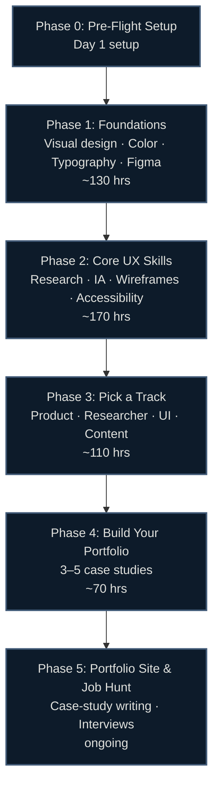

# 🎨 UI/UX Design Career Roadmap: Zero to First Job

> Hour-based, research-backed (June 2026), region-agnostic. Every topic points to a **specific, verified, free or freemium tool or lab** — never "go figure it out." Built for complete beginners with no degree.

[]()
[]()

> [!IMPORTANT]
> **Read this first: "UX Designer" is a portfolio-driven field, and the entry bar rose after 2022.** The 2020–2022 bootcamp boom flooded the market; tech layoffs put senior designers back in the pool competing for junior roles. Many "entry-level" postings quietly expect 2–3 years of experience. This is still a real direct-entry path — unlike product management — but you get in with **a strong case-study portfolio**, not a cert. This guide gets you to that portfolio, then to the first offer.

## 🗺️ Roadmap at a Glance



## ⏱️ How the Hour System Works

Timelines are in **study hours**, not weeks — so they work at any pace.

| Your pace | 500 hours takes |
|---|---|
| 1 hr/day | ~17 months |
| 2 hrs/day | ~8 months |
| 4 hrs/day | ~4 months |
| 6 hrs/day (full-time) | ~3 months |

Each phase shows an approximate hour band — a budget, not a deadline. Go at whatever pace fits your life.

## 📚 Guide Contents

| File | What's inside |
|---|---|
| [00-prep.md](00-prep.md) | Mindset, the honest career reality, accounts, free tooling setup |
| [01-foundations.md](01-foundations.md) | Visual design principles, color theory, typography, Figma fundamentals |
| [02-core.md](02-core.md) | User research, information architecture, wireframing, accessibility (WCAG 2.2), design systems |
| [03-specialization.md](03-specialization.md) | Pick a track: Product Designer, UX Researcher, UI/Visual Designer, Content Designer |
| [04-projects.md](04-projects.md) | Portfolio case studies — what gets hired vs what gets rejected |
| [05-job-hunt.md](05-job-hunt.md) | Portfolio site, case-study writing, interview formats, role-targeting |
| [beyond-entry.md](beyond-entry.md) | Senior tracks, design systems, research lead, design management (Years 2+) |
| [certifications.md](certifications.md) | Full cert matrix, ROI tiers, recommended paths |
| [labs.md](labs.md) | Verified interactive tool and practice inventory |
| [resources.md](resources.md) | Courses, YouTube channels, books, communities |
| [interview-prep.md](interview-prep.md) | Portfolio review walkthrough, app critique, design process Q&A, behavioral prompts |

## 🏁 Certification Reality (2026)

```
[Optional]     Google UX Design Professional Certificate (~$294, ~6 mo) — ATS keyword help
[Self-directed] IxDF Membership (~$156/yr) — 40+ courses, signals genuine learning
[Senior only]  NN/g UX Certification (~$6,400) — respected, skip until experienced
[Skip]         Adobe Certified Professional — tool cert, not a UX-practice signal
               Figma has no formal certification (cert page 404)
```

> ⚠️ **Portfolio is the real filter.** Certs appear in fewer than 10% of UX job postings. Three strong case studies outweigh any certificate at the entry level. See [certifications.md](certifications.md) for the full picture.

## ✅ What Makes This Guide Different

- **Honest about the entry bar** — portfolio-first, not cert-first. No false promises about bootcamp-to-job timelines.
- **Portfolio-driven** — every phase builds toward case studies, not just skill accumulation.
- **Hour-based** — fits any schedule, not rigid weeks.
- **Verified June 2026** — tool versions, cert prices, and dead resources checked. Adobe XD discontinued; flagged.
- **Region-agnostic** — no salary tables, no local job-board lists; strategy that works anywhere.
- **Free-first** — Figma Starter, Penpot, FigJam, Behance, Sharpen.design, Daily UI, Stark plugin.
- **Accessibility built in** — WCAG 2.2 woven through Phase 2, not bolted on at the end.
- **Honest on AI** — generative UI tools raise the visual floor; juniors need to show research and strategy depth to differentiate.

---

*Last verified: June 2026. Tool pricing and cert details change — confirm with the provider before booking. Sources in [/research](../../research/).*
