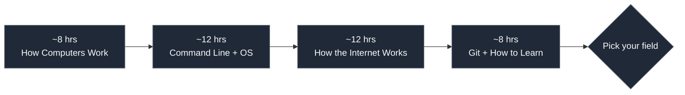

# Shared Foundations — Hours 0–40

> **Everyone starts here, no matter which field you pick.** These are the universal skills every IT career assumes you already have: how computers work, the command line, how the internet moves data, and how to actually learn technical material. Do this *before* you commit to a field — by the end, the right path is usually obvious, and you haven't lost anything if you change your mind.

**Total: ~40 hours.** Go at whatever pace fits your life — there's no deadline. Everything here is **free** and **verified live (June 2026)**.

---

## Block 1 · How Computers Actually Work

**Why:** Every field — dev, security, cloud, data, support — assumes you know what a CPU, RAM, storage, and an operating system *do*. This is the bedrock.

**What to cover:**
- Hardware: CPU (cores, clock speed), RAM vs storage (volatile vs persistent), SSD vs HDD, motherboard, GPU — what each part does and how they talk
- Binary & data: bits/bytes, how text/images/numbers become 1s and 0s, why "8GB RAM" matters
- What an operating system is: the layer between hardware and your apps; Windows vs macOS vs Linux at a high level
- Software vs hardware; what "running a program" actually means (load into RAM, CPU executes)

**Theory (free, named):**
- [Branch Education](https://www.youtube.com/@BranchEducation) — 3D animations: "How does a CPU work?", "How do SSDs work?"
- [CrashCourse Computer Science](https://www.youtube.com/playlist?list=PL8dPuuaLjXtNlUrzyH5r6jN9ulIgZBpdo) — episodes 1–10 for the big picture
- [Harvard CS50 — Week 0 (Scratch) & Week 1](https://cs50.harvard.edu/x/) — the single best free "how computing works" intro (audit free)

**Interactive lab:**

| Lab | Platform | What you do | Cost | Status |
|---|---|---|---|---|
| [Intro to Cybersecurity / How computers work modules](https://www.codecademy.com/learn/introduction-to-cybersecurity) | Codecademy | Interactive lessons on OS layers & core concepts | Free tier | ✅ live |
| [CS50x Week 0–1](https://cs50.harvard.edu/x/) | edX/Harvard | Browser IDE; build logic in Scratch then C | Free (audit) | ✅ live |

**Practice gate:** You can explain, out loud, the difference between RAM and storage, and what the OS does — without notes.

---

## Block 2 · Command Line + Operating System Literacy

**Why:** The terminal is the universal tool. Devs, cloud engineers, security analysts, data folks, and sysadmins all live in it — get comfortable now and every field gets easier.

**What to cover (Linux/macOS shell + Windows equivalents):**
- Navigation: `pwd`, `ls`/`dir`, `cd`, paths (absolute vs relative), `~` home
- Files: `cat`, `less`, `cp`, `mv`, `rm`, `mkdir`, `touch`, `find`
- Text & search: `grep`, pipes `|`, redirects `>` `>>`, `wc`, `sort`, `head`/`tail`
- Permissions: read/write/execute, `chmod`, `chown`, octal (755, 644)
- Processes: `ps`, `top`, `kill`; environment variables; `sudo`
- Windows side: PowerShell basics (`Get-ChildItem`, `Get-Content`, `Get-Process`), CMD (`ipconfig`, `dir`)
- Package managers concept: `apt`, `brew`, `winget`

**Theory (free, named):**
- [Professor Messer — CompTIA basics](https://www.professormesser.com/free-a-plus-training/220-1202/220-1202-video/220-1202-training-course/) for OS overview
- [The Missing Semester (MIT)](https://missing.csail.mit.edu/) — lectures 1–2 (shell + scripting), genuinely the best CLI intro
- [NetworkChuck — "Linux for beginners"](https://www.youtube.com/@NetworkChuck) for an energetic walkthrough

**Interactive labs:**

| Lab | Platform | What you do | Cost | Status |
|---|---|---|---|---|
| [OverTheWire — Bandit (Levels 0–15)](https://overthewire.org/wargames/bandit/) | OverTheWire | SSH into real Linux boxes; solve puzzles with `cat`, `grep`, `find`, `ssh`, `base64` | **Free** | ✅ live |
| [Linux Fundamentals module](https://academy.hackthebox.com/) | HTB Academy | Guided bash, permissions, package mgmt against a live target | Free tier | ✅ live |
| [Linux Journey](https://labex.io/linuxjourney) | Web | Self-paced text lessons + quizzes | **Freemium** | ✅ live |

**Practice gate:** Complete **OverTheWire Bandit levels 0–15** unaided. This single achievement proves real CLI competence.

---

## Block 3 · How the Internet Works

**Why:** Networking is the connective tissue of all of IT. You can't secure, deploy, debug, or support what you don't understand at the packet level — so it's worth getting right early.

**What to cover:**
- The request/response model: what *actually* happens when you type a URL and hit enter (DNS → TCP → TLS → HTTP → render)
- IP addressing (IPv4/IPv6), ports, the difference between public/private IPs
- DNS: how names become addresses; records (A, CNAME, MX)
- HTTP/HTTPS: methods (GET/POST), status codes (200/404/500), headers, why HTTPS matters
- The OSI model (7 layers) and TCP/IP model — at least conceptually
- Key protocols & ports: HTTP 80, HTTPS 443, SSH 22, DNS 53, SMTP 25
- LAN vs WAN, routers vs switches, what your home router does

**Theory (free, named):**
- [PowerCert Animated Videos](https://www.youtube.com/@PowerCertAnimatedVideos) — OSI model, TCP/IP, DNS explained visually
- [Professor Messer Network+ playlist](https://www.professormesser.com/network-plus/n10-009/n10-009-video/n10-009-training-course/) — Network Concepts section
- ["How DNS works" — howdns.works](https://howdns.works/) — friendly comic

**Interactive labs:**

| Lab | Platform | What you do | Cost | Status |
|---|---|---|---|---|
| [Introduction to Networking module](https://academy.hackthebox.com/) | HTB Academy | Interactive OSI, TCP/IP, subnetting, DNS, ARP questions | Free tier | ✅ live |
| [SubnettingPractice.com](https://subnetipv4.com/) | Web | Drill subnetting until automatic | **Free** | ⛔ dead |
| [Wireshark: The Basics](https://tryhackme.com/room/wiresharkthebasics) | TryHackMe | Load real packet captures, filter traffic, see protocols live | Free room | ✅ live (rate-limits bots) |

**Practice gate:** You can narrate, step by step, what happens between pressing Enter on `https://example.com` and the page appearing.

---

## Block 4 · Git, GitHub & How to Learn

**Why:** Git is how the whole industry tracks work and collaborates. GitHub is your public portfolio — it's what gets you hired, especially without a degree. And knowing *how to learn* technical material is the meta-skill that determines whether you'll finish any of these guides.

**What to cover (Git/GitHub):**
- Why version control exists; what a repo, commit, branch, and remote are
- Core flow: `git init`, `git add`, `git commit`, `git push`, `git pull`, `git clone`
- Branching & merging basics; what a merge conflict is
- GitHub: creating repos, writing a good README, pull requests, issues
- Markdown (you're reading it) — headings, lists, code blocks, tables, links

**What to cover (how to learn):**
- **Active > passive:** doing labs beats watching videos. Aim for 70% hands-on.
- **Spaced repetition:** use [Anki](https://apps.ankiweb.net/) for facts (ports, commands, acronyms)
- **The "build to learn" loop:** learn a concept → immediately apply it in a tiny project → document it
- **Note-taking:** keep a searchable second brain ([Obsidian](https://obsidian.md/) free) — future-you will thank you
- Avoid tutorial hell: after a tutorial, rebuild the thing *without* following along

**Theory (free, named):**
- [The Odin Project — Git Basics](https://www.theodinproject.com/) — free, hands-on
- [freeCodeCamp — "Git and GitHub for Beginners" (YouTube)](https://www.youtube.com/@freecodecamp)
- [GitHub Skills](https://skills.github.com/) — interactive, in-platform exercises

**Interactive labs:**

| Lab | Platform | What you do | Cost | Status |
|---|---|---|---|---|
| [GitHub Skills](https://skills.github.com/) | GitHub | Guided real PRs/commits inside GitHub itself | **Free** | ✅ live |
| [Learn Git Branching](https://learngitbranching.js.org/) | Web | Visual, interactive branching/merging game | **Free** | ✅ live |

**Practice gate:** You have a **GitHub account** with at least one repo that has a real README, and you can commit + push from the command line without looking it up.

---

## ✅ You're done with foundations. Now choose.

By now you can use a terminal, you understand how computers and the internet work, and you have a GitHub account. You've probably also noticed which blocks you actually *enjoyed*:

- **Loved the CLI puzzles and "how could this break?"** → [Cybersecurity](../guides/cybersecurity/)
- **Loved building logic in CS50** → Software Development
- **Loved networking + wanting things to run reliably** → Cloud & DevOps, or IT Support
- **Loved finding patterns in data** → Data, AI & Analytics
- **Loved helping and explaining** → IT Support & Networking
- **Cared most about how it *feels* to use** → [UI/UX Design](../guides/ux-design/)
- **Liked deciding *what* to build and *why*, and coordinating people** → [Product Management](../guides/product-management/) *(usually a second job, not a first)*

Still torn? Take the [Career-Match Quiz](career-quiz.md) or re-read [what each field actually is](what-is-each-field.md).

> **Whichever you pick, none of this time was wasted.** Every field guide builds directly on these four blocks — they assume you can already do everything above.

---

*Back to: [Start Here](README.md) · [What Each Field Is](what-is-each-field.md) · [Career Quiz](career-quiz.md)*
